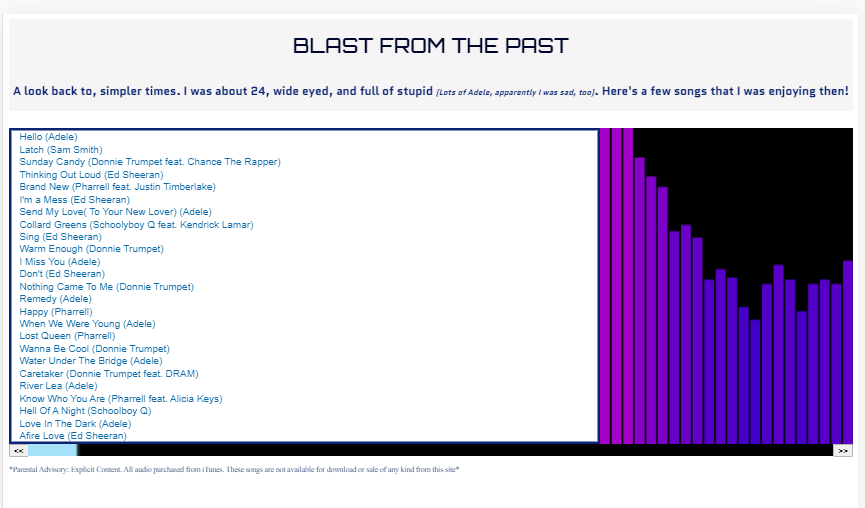

# JS-Audio-Player :headphones:
A mp3 audio player made with JavaScript. Created to practice vanilla JS skills.

## Deployed At: 
https://js-music-app.netlify.app/

## Features: 
* Users can play audio files and view vizualizations based on song.

## Built With:
*JavaScript, CSS*

## Specifications: 
* Audio files used are personal purchased MP3 files.
* Visualizations done using Web Audio API
* Article on creating vizualizations: 
https://developer.mozilla.org/en-US/docs/Web/API/Web_Audio_API/Visualizations_with_Web_Audio_API
